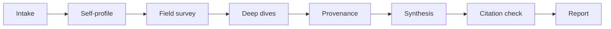
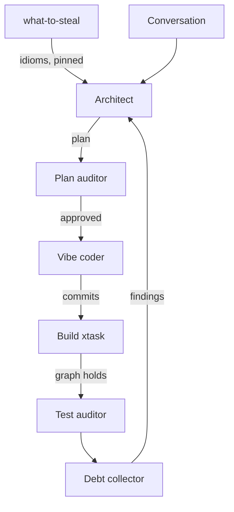
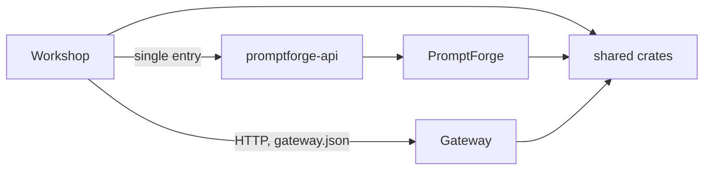

# Structure Before Code: How PromptForge Ships Tens of Thousands of Lines a Day Without Reading Them

Report type: research / scientific, written as a field report with a white-paper close. It states a question, describes the method a working team uses to answer it, presents the evidence from that team's public repositories, and interprets the result. Every repository link is pinned to a commit so the evidence stays where the reader can check it.

## Abstract

Agentic coding moved the bottleneck. One developer with a planning agent and a coding agent now commits code faster than any reviewer can read it: the [PromptForge](https://github.com/cppalliance/promptforge/tree/09f29994c513b9b7104c0a66952d82dcccd364c8) repository absorbed 498 commits, 255,965 inserted lines, and 154,306 deleted lines across 6,797 file changes in the first sixteen days of September 2026, with 479 of those commits from one author. Line-by-line review does not survive that rate, so the team replaced it with three cheaper reviews aimed at three smaller artifacts. Humans review the plan before any code is generated. The build reviews the structure on every commit through a compiled dependency matrix in [`build-xtask`](https://github.com/cppalliance/promptforge/tree/09f29994c513b9b7104c0a66952d82dcccd364c8/crates/build-xtask). Tests accumulate against narrow public surfaces and serve as a ratchet rather than a gate. The structure the plans put on the page is not invented; it is recovered from the field by a procedure called [what-to-steal](https://github.com/cppalliance/tools-public/blob/134c3be7ee3e0e800be6fb4ad4758d469c5d9f81/planning/what-to-steal.md), which profiles the codebase, dives six or seven mature projects at pinned commits, and reports the idioms they converged on with every citation checked. One 400-line plan review caught three semantic defects before a line was generated. Two independent comparisons against open-source Tauri IDEs, [SideX](https://github.com/Sidenai/sidex/tree/ad978652682270a593e7029269beff5411477a70) and [OPIDE](https://github.com/OpenPawz/OPIDE/tree/fc5ac99426b74aaa35a5ab94827532f38d7c2661), found PromptForge ahead on lint discipline, test count, type strictness, and enforced architecture. The finding is that structure, defined operationally as everything whose cost-to-change grows with the code built on it, is the correct review surface for agent-written software, and that names and design patterns belong to structure as much as crate graphs do.

## Contents

1. [The review bottleneck is real and the fix is not more reviewers](#1-the-review-bottleneck-is-real-and-the-fix-is-not-more-reviewers)
2. [Structure has an operational definition, and it includes names and patterns](#2-structure-has-an-operational-definition-and-it-includes-names-and-patterns)
3. [Method: two workflows and one build feed a single loop](#3-method-two-workflows-and-one-build-feed-a-single-loop)
4. [Results: the record, the plans, the research, and the numbers](#4-results-the-record-the-plans-the-research-and-the-numbers)
5. [Discussion: why structure is the review surface](#5-discussion-why-structure-is-the-review-surface)
6. [Conclusion: six steps to adopt the workflow](#6-conclusion-six-steps-to-adopt-the-workflow)
7. [References](#7-references)
8. [Appendices](#8-appendices)

## 1. The review bottleneck is real and the fix is not more reviewers

When a single developer directs agents that produce tens of thousands of lines of code per day, what replaces code review? The project owner, Vinnie Falco, put the premise this way on 2026-09-16: "Agentic workflows enable a single developer to produce tens of thousands of lines of code per day, at scale, and the possibility of reviewing it is basically zero. So we need a new workflow that recognizes that individual code review is not really practical. Spot checks, yes. Reviewing every line, not gonna happen."

The premise is measurable. The [PromptForge](https://github.com/cppalliance/promptforge/tree/09f29994c513b9b7104c0a66952d82dcccd364c8) repository, a Cargo workspace of 45 crates holding 210,365 lines of Rust and a 15,338-line TypeScript single-page application in 102 files, began on 2026-07-28. By 2026-09-16 it held 1,321 commits, about 26 per day, 1,301 of them by Falco. September alone contributed 498 commits and a quarter of a million inserted lines, with 74 commits on 2026-09-02, 58 on 2026-09-14, and 50 on 2026-09-12. Every plan that produced that code is committed to the public [`vibe/`](https://github.com/cppalliance/promptforge/tree/09f29994c513b9b7104c0a66952d82dcccd364c8/vibe) directory, dated and numbered by day, and every research report that fed those plans is committed to the public [`research/`](https://github.com/cppalliance/promptforge-design/tree/80f5983ae28ae3e5e874e70362fdcf821105c5b4/research) directory of the design repository. The whole record is public.

The answer is that the review moves to three artifacts smaller than the code. A plan auditor reads the plan before generation. A structure auditor reads the crate graph, the public surfaces, and the invariant headers after generation, most of which the build has already checked. A test auditor reads the tests and the acceptance criteria, and adds tests over time. Nobody reads the implementation. Falco's summary is that "structure is everything."

## 2. Structure has an operational definition, and it includes names and patterns

### 2.1 Structure is whatever grows expensive to change

The word structure is often used loosely. In this workflow it has a working definition: structure is the set of things whose cost-to-change grows with the amount of code built on top of them. Persisted schema is the most expensive, because data outlives code. Public types come next, then crate names and dependency edges, then wire protocols. Local implementation sits at the bottom with a cost-to-change near zero, because a crate with a narrow public API and a deep implementation can have its implementation thrown out and regenerated. Falco stated the consequence directly: "crates with narrow public APIs and deep implementation are the holy grail. You can throw out the entire implementation and ask the LLM to write a new one, for just a few hours work."

This definition is what tells the planner what belongs on the page. When Falco asked the planning agent for a plan, he asked four questions: what do the CREATE TABLE statements look like, what do the top-level structs look like, what are the names of the crates being created, and what are the dependencies. Those four are the items with the highest cost-to-change. The planning tool encodes the same list as its rule for the Technical Design section: "Technical Design includes only cross-module or externally observable design. Omit local implementation details unless they change a public interface, persisted data, a protocol, security or privacy behavior, failure behavior, or a lifecycle constraint" ([architect.md](https://github.com/cppalliance/tools-public/blob/134c3be7ee3e0e800be6fb4ad4758d469c5d9f81/planning/architect.md)).

### 2.2 The three products and their enforced boundaries are the skeleton

PromptForge is three products in one workspace, and the build enforces the boundaries between them; no reviewer has to remember them. [`AGENTS.md`](https://github.com/cppalliance/promptforge/blob/09f29994c513b9b7104c0a66952d82dcccd364c8/AGENTS.md) names them: PromptForge is the runtime execution engine for a prompting language of structured Markdown with live Lua fences; [Gateway](https://github.com/cppalliance/promptforge/tree/09f29994c513b9b7104c0a66952d82dcccd364c8/crates/gateway) is an independent service that proxies local and remote inference through one OpenAI-compatible endpoint, launching [llama.cpp](https://github.com/ggml-org/llama.cpp) as a child process for local models; [Workshop](https://github.com/cppalliance/promptforge/tree/09f29994c513b9b7104c0a66952d82dcccd364c8/crates/workshop) is the desktop product, a [Tauri](https://tauri.app) shell around an HTML, CSS, and TypeScript single-page application served by an in-process [axum](https://github.com/tokio-rs/axum) server.

The dependency rules between them are ten lines (Appendix A). Workshop crates never depend on gateway crates. Gateway crates never depend on promptforge or workshop crates. PromptForge crates never depend on gateway or workshop crates. Outside crates reach the PromptForge runtime through one crate, [`promptforge-api`](https://github.com/cppalliance/promptforge/tree/09f29994c513b9b7104c0a66952d82dcccd364c8/crates/promptforge-api), and never through the internal substrate; call that the single-entry rule. [`shared-*`](https://github.com/cppalliance/promptforge/tree/09f29994c513b9b7104c0a66952d82dcccd364c8/crates/shared-promptforge-api) crates hold the cross-product vocabulary and depend on no product crate. The rules bind every dependency kind: normal, dev, build, and target-specific. Inside Workshop, dependencies flow one way, shell to features to services to vocabulary, and a Cargo cycle means the design is wrong, not the graph. Every one of these rules is checked by [`product.rs`](https://github.com/cppalliance/promptforge/blob/09f29994c513b9b7104c0a66952d82dcccd364c8/crates/build-xtask/src/product.rs) and [`tidy.rs`](https://github.com/cppalliance/promptforge/blob/09f29994c513b9b7104c0a66952d82dcccd364c8/crates/build-xtask/src/tidy.rs) when `cargo test -p build-xtask` runs in CI.

The skeleton is what lets headcount scale by physical decomposition. Each product can have its own plans and its own team because the only shared surface is the enumerated set of seams: the `shared-*` crates, `promptforge-api`, the [`gateway.json` discovery seam](https://github.com/cppalliance/promptforge/tree/09f29994c513b9b7104c0a66952d82dcccd364c8/crates/shared-sidecar), and the HTTP and WebSocket contracts. Coordination cost is proportional to seam size, not codebase size.

### 2.3 Names are structure

A name the field has converged on is a shared contract with the model's training data. When the Workshop team rebuilt its menus, the research report that preceded the work, [How the VS Code Family Builds Menus](https://github.com/cppalliance/promptforge-design/blob/80f5983ae28ae3e5e874e70362fdcf821105c5b4/research/workshop-steal-vscode-menu-architecture.md), tabulated 22 concepts across three independent implementations: [VS Code](https://github.com/microsoft/vscode/tree/925a0ffbf3e488061e4c01ae9d9ac88ae6907a7e) upstream, [Theia](https://github.com/eclipse-theia/theia/tree/0b5a5f27164581ca47b8d7c08eaf690ac23d932f) as a clean-room reimplementation, and [OpenSumi](https://github.com/opensumi/core/tree/9fee6aa38f96f85ac686f25c2522910067324c1d) as a second reimplementation. The reimplementations matched VS Code on eighteen of the twenty-two by name or shape. OpenSumi copied VS Code's `MenuId` outright rather than design its own. The report's conclusion was that the Workshop "should stop inventing," and the resulting code keeps the field's names: [`command-registry.ts`](https://github.com/cppalliance/promptforge/blob/09f29994c513b9b7104c0a66952d82dcccd364c8/crates/workshop-server/ui/src/services/command-registry.ts), [`menu-registry.ts`](https://github.com/cppalliance/promptforge/blob/09f29994c513b9b7104c0a66952d82dcccd364c8/crates/workshop-server/ui/src/services/menu-registry.ts), [`keybinding-registry.ts`](https://github.com/cppalliance/promptforge/blob/09f29994c513b9b7104c0a66952d82dcccd364c8/crates/workshop-server/ui/src/services/keybinding-registry.ts), [`context-key-service.ts`](https://github.com/cppalliance/promptforge/blob/09f29994c513b9b7104c0a66952d82dcccd364c8/crates/workshop-server/ui/src/services/context-key-service.ts), [`quick-access-registry.ts`](https://github.com/cppalliance/promptforge/blob/09f29994c513b9b7104c0a66952d82dcccd364c8/crates/workshop-server/ui/src/services/quick-access-registry.ts), and [`action-registry.ts`](https://github.com/cppalliance/promptforge/blob/09f29994c513b9b7104c0a66952d82dcccd364c8/crates/workshop-server/ui/src/services/action-registry.ts) with its `registerAction` descriptor modeled on VS Code's [`registerAction2`](https://github.com/microsoft/vscode/blob/925a0ffbf3e488061e4c01ae9d9ac88ae6907a7e/src/vs/platform/actions/common/actions.ts#L723-L781).

The same principle applies to crates. The [crate taxonomy rename](https://github.com/cppalliance/promptforge/blob/09f29994c513b9b7104c0a66952d82dcccd364c8/vibe/2026-09-02-5-crate-taxonomy-rename.md) of 2026-09-02 gave every crate a prefix that states its product, which is what lets [`product.rs`](https://github.com/cppalliance/promptforge/blob/09f29994c513b9b7104c0a66952d82dcccd364c8/crates/build-xtask/src/product.rs) classify a crate into its family by name alone. The pending Turso plan proposes renaming `shared-sidecar` to `shared-gateway-discovery` because the crate is the `gateway.json` discovery seam and "sidecar" names an architecture that was retired by the [gateway sidecar decomposition](https://github.com/cppalliance/promptforge/blob/09f29994c513b9b7104c0a66952d82dcccd364c8/vibe/2026-09-03-3-gateway-sidecar-decomposition.md). A name that says what a crate is, rather than what it used to serve, is a structural fix.

### 2.4 Design patterns are structure

A pattern the field converged on is one the model extends correctly without supervision, because the pattern defines where the next piece goes. The Workshop's registries are the clearest example. No composition file knows every interface part; parts register themselves. On the server side, [`workshop-registry`](https://github.com/cppalliance/promptforge/tree/09f29994c513b9b7104c0a66952d82dcccd364c8/crates/workshop-registry) is a vocabulary-tier crate holding four contribution collections (routes and background tasks as ordered vectors of trait objects, state handles and push sinks as maps keyed by type) into which subsystems self-register. Its [`lib.rs`](https://github.com/cppalliance/promptforge/blob/09f29994c513b9b7104c0a66952d82dcccd364c8/crates/workshop-registry/src/lib.rs) states the invariant that makes it structure: "Never add a field, slot, or accessor naming a subsystem; a new subsystem changes its own crate and one `register` call, never this crate." On the SPA side, [`panel-registry.ts`](https://github.com/cppalliance/promptforge/blob/09f29994c513b9b7104c0a66952d82dcccd364c8/crates/workshop-server/ui/src/services/panel-registry.ts) exposes `registerPanelType` and `registerPanelFactory`, and each concern directory's `index.ts` is the activation hook that registers its own panel, as [`ui/editor/index.ts`](https://github.com/cppalliance/promptforge/blob/09f29994c513b9b7104c0a66952d82dcccd364c8/crates/workshop-server/ui/src/ui/editor/index.ts) does for the editor. Falco described the result on 2026-09-16: "There is no god file which knows about each interface part. There's a PartRegistry now. This is the correct interface, gleaned from what-to-steal, and I know now that when the LLM is going to add a new part, say a Terminal window, then it will be able to do so cleanly because the interface is there."

The menus use the same shape. A submenu is a menu item whose payload is another menu id, the menubar is generated from the children of a root `MenubarMainMenu`, and rows are appended with `appendMenuItem` from whichever feature owns them ([`menubar.contribution.ts`](https://github.com/cppalliance/promptforge/blob/09f29994c513b9b7104c0a66952d82dcccd364c8/crates/workshop-server/ui/src/ui/menu/menubar.contribution.ts)). Falco tested the pattern's reach before running the [menu overhaul plan](https://github.com/cppalliance/promptforge/blob/09f29994c513b9b7104c0a66952d82dcccd364c8/vibe/2026-09-15-5-workshop-menu-overhaul.md) by asking whether a feature the plan deliberately omitted, the right-click context menu on a document tab, could be added later without rework. The answer was yes: the menu is VS Code's `EditorTitleContext`, built from the same three primitives the plan delivers, a `MenuId` populated by `appendMenuItem`, the popover widget, and commands taking the clicked tab as an argument. Five of its rows were already wired commands. A pattern that answers "where does the next thing go" before the next thing exists is structure by the definition in 2.1.

## 3. Method: two workflows and one build feed a single loop

The workflow has two model-driven procedures and one mechanical check. The first procedure, what-to-steal, discovers what structure is idiomatic for a domain by reading the field. The second, the Architect, puts that structure on a page a human can review before any code exists. The build then holds the structure in place on every commit. This section describes each in enough detail that another team could run it. All three tools are public in the [`planning/`](https://github.com/cppalliance/tools-public/tree/134c3be7ee3e0e800be6fb4ad4758d469c5d9f81/planning) directory of [tools-public](https://github.com/cppalliance/tools-public/tree/134c3be7ee3e0e800be6fb4ad4758d469c5d9f81), released under CC0.

### 3.1 what-to-steal recovers structure from the field with pinned evidence

[what-to-steal](https://github.com/cppalliance/tools-public/blob/134c3be7ee3e0e800be6fb4ad4758d469c5d9f81/planning/what-to-steal.md) answers one question: what structure is idiomatic for this domain? Falco's gloss is that "what-to-steal answers the question, what structure is idiomatic for the domain," and that it "bridges the gap" between depending on external crates and building new machinery. It runs in eight steps: intake, self-profile, field survey, deep dives, provenance, synthesis, citation check, report.

*Figure 1. The eight steps of what-to-steal. Steps 2 through 5 and 7 run in isolated subagents; the main context receives only bounded briefs.*

**Intake** takes the subject paths, an optional focus, and a reference count, default five. **Self-profile** reads the subject through nine lenses (Appendix C): module decomposition, state ownership, boundaries and protocols, error shape, resource lifecycle, testing, comment policy, build and delivery, and the messes. It returns a fingerprint plus five to eight named deficits and three to five strengths, capped at 800 tokens. **Field survey** searches the web for open-source projects sharing the subject's stack, gathers up to twenty candidates, and verifies each against its dependency manifest or source files, never its README; unverified candidates are marked as such. Popularity is a tiebreaker, not a ranking axis. **Deep dives** run in parallel, one subagent per shortlisted reference, each cloning at a pinned commit, applying the same nine lenses, and citing every claim to file and line. An idiom is worth stealing when its mechanism is deliberate and applies to the subject's stack; each idiom names the deficit it retires and an adoption cost of small, medium, or large.

**Provenance** dates each cited file. A subagent scans commit messages since 2022 for AI co-author trailers and generation markers, walks each cited file's history, and tags the idiom `strong human signal`, `explicit AI marker`, `mechanical automation`, or `unknown`. Where an AI-marked commit touched the file, the examiner reads the last pre-AI version and states whether the mechanism at HEAD held up, tightened, or degraded. The tag adjusts an idiom's rank; it never disqualifies one. **Synthesis** clusters idioms across briefs, and an idiom confirmed by two or more references outranks any single-source idiom. Idioms map onto the named deficits; those that map to none are noted but not scheduled. Ranking is by deficit severity first, convergence second, adoption cost third. **Citation check** opens every cited location in the pinned clones and confirms the mechanism is there; a finding whose only citation fails is dropped, not softened. **Report** follows a fixed template: executive summary, key findings with confidence tags, method, reference table with provenance, baseline, ranked findings, a matches-or-beats list, a messes-not-to-copy list, execution order, refactor notes, and sources as URLs with SHAs.

The token economy is a rule. Main context never reads subject or reference source; it holds intake values, the briefs, and file paths. That is what lets the procedure dive six or seven large codebases in one session without exhausting the planner's context. The procedure grew out of two earlier one-shot studies committed to the vibe directory, the [agent runtime field comparison](https://github.com/cppalliance/promptforge/blob/09f29994c513b9b7104c0a66952d82dcccd364c8/vibe/agent-runtime-field-comparison-and-adoption.md) and the [speech-to-text field comparison](https://github.com/cppalliance/promptforge/blob/09f29994c513b9b7104c0a66952d82dcccd364c8/vibe/stt-field-comparison-and-adoption.md), and was generalized on 2026-08-27.

### 3.2 The Architect puts structure on a page before generation

The [Architect](https://github.com/cppalliance/tools-public/blob/134c3be7ee3e0e800be6fb4ad4758d469c5d9f81/planning/architect.md) is a planning rulebook that accumulates design during a conversation and consolidates it into a self-contained plan. Its unit is the design element: one decision, requirement, constraint, risk, assumption, rejected alternative, or open question. It consolidates when 750 tokens of new material or seven new elements have accumulated, whichever comes first, and always before handoff. Each consolidation updates the plan in place, merges duplicates, removes superseded material, and preserves rationale. When two user statements conflict, it quotes both and asks which governs.

The plan has exactly seven sections inside six validated contract tags: Product Requirements and Functional Specification inside `product-contract`; Technical Design inside `implementation-contract`; Testing Plan inside `verification-contract`; Decision Record, with an optional Deferred and Out of Scope subsection, inside `decision-record`; Project Survey inside `project-survey`; Execution Instructions inside `execution-plan` (Appendix B). Every repository or web fact enters through an isolated evidence reader that answers one bounded question and returns at most 500 tokens in four fixed items: answer, sources, uncertainty, missing evidence. The plan cites each repository fact with a path. Before handoff, the Architect audits the plan for self-containment: a reader without the conversation must be able to interpret every requirement, decision, constraint, work item, and verification expectation. Execution Instructions stay unordered; decomposition and commit sequencing belong to the executor.

The Architect's own statement of what it refuses to do is the clearest description of the plan it produces: it "retains only what the design bears, and never confuses the enforcement of a rule with the service of your intent." Falco, on the review model the plan enables: "Do we like this development model of reviewing plans? Feels more friendly and practical than reviewing slop PRs."

### 3.3 Three human roles read three artifacts, and none of them is the implementation

The workflow assigns humans to three reviews. Each has a bounded reading surface, which is what makes the roles teachable to a new team member who was not present at planning.

| Role | Reads | When | What it judges |
|---|---|---|---|
| Plan auditor | The Architect's plan: schema, top-level types, crate names, dependency edges, endpoints, decisions with quoted rationale | Before generation | Whether the expensive-to-change items are right |
| Structure auditor | The crate graph, [`## Invariants`](https://github.com/cppalliance/promptforge/blob/09f29994c513b9b7104c0a66952d82dcccd364c8/crates/workshop-registry/src/lib.rs) headers, public surfaces, [`product.rs`](https://github.com/cppalliance/promptforge/blob/09f29994c513b9b7104c0a66952d82dcccd364c8/crates/build-xtask/src/product.rs) and [`tidy.rs`](https://github.com/cppalliance/promptforge/blob/09f29994c513b9b7104c0a66952d82dcccd364c8/crates/build-xtask/src/tidy.rs) output | After generation | Whether a new public item belongs, whether a crate grew a second responsibility |
| Test auditor | The tests and the plan's acceptance criteria | Ongoing | Whether coverage of the public surface is complete; adds tests as the team grows |

*Table 1. The three reviewer roles, the artifact each reads, and the question each answers. The implementation appears in none of the rows.*

The plan auditor reads the plan because that is where the expensive-to-change items are visible before they cost anything. The structure auditor's job is mostly automated: `cargo test -p build-xtask` already fails the build on a tier violation, a product-boundary breach, a lint-inheritance gap, or a file over 500 lines, so the human judges only the questions a matrix cannot, such as whether a crate is growing a second responsibility. The test auditor's job is a ratchet. Falco's rule: "You can always add tests later. You want to vibe quickly, and you don't want to get bogged down. We get some tests during the vibe, we can add more tests later as the team grows." Tests written later target the crate's public API and stay out of its internals, so they survive when the implementation is regenerated.

Headcount scales by adding auditors to each role and by decomposing the product so that plans in different products cannot conflict on anything except a seam. Falco's answer to "how do we put more people on a project": "More people auditing plans before they execute, people auditing the structure of the code after the vibe executes, people looking at the tests to make sure that they're comprehensive, adding tests, improving tests."

### 3.4 The build holds the structure on every commit

The mechanical half of the workflow is [`build-xtask`](https://github.com/cppalliance/promptforge/tree/09f29994c513b9b7104c0a66952d82dcccd364c8/crates/build-xtask), run as `cargo test -p build-xtask` in the [`ci.yml`](https://github.com/cppalliance/promptforge/blob/09f29994c513b9b7104c0a66952d82dcccd364c8/.github/workflows/ci.yml) workflow. [`product.rs`](https://github.com/cppalliance/promptforge/blob/09f29994c513b9b7104c0a66952d82dcccd364c8/crates/build-xtask/src/product.rs) classifies every workspace crate into a family by name prefix and checks every dependency of every kind against the matrix in Appendix A, including the single-entry rule. [`tidy.rs`](https://github.com/cppalliance/promptforge/blob/09f29994c513b9b7104c0a66952d82dcccd364c8/crates/build-xtask/src/tidy.rs) checks the four-tier Workshop graph (vocabulary: `workshop-protocol`, `workshop-registry`, `workshop-support`; services: `workshop-gateway`, `workshop-menu`, `workshop-status`; features: `workshop-sessions`, `workshop-workspace`; shell: `workshop-server`), the 500-line file ceiling over every crate opting in through the `## Invariants` marker, and lint inheritance from the workspace. Nine `workshop-*` crates open their `lib.rs` with that marker today. The model for this design was [rust-analyzer's `tidy.rs`](https://github.com/rust-lang/rust-analyzer/blob/6aeeb8cf02741e5da07a1615a05faa506cecb21a/xtask/src/tidy.rs), which runs architecture rules as `#[test]` functions; the research that recommended it is case study 2.

Falco's framing of why this matters for agents: "If the structure is wrong, the LLM will happily build on it and create a ... mess. If the structure is clean, the LLM will build on that as well, it will color within the lines of the structure." And: "cargo lets you easily enforce relationships between library components and also ad-hoc rules."

The loop closes as follows. what-to-steal reads the field and reports idioms; the Architect consumes the report and the conversation and produces a plan; the plan auditor reads the plan; the [vibe coder](https://github.com/cppalliance/tools-public/blob/134c3be7ee3e0e800be6fb4ad4758d469c5d9f81/planning/vibe-coder.md) executes the plan's work items with per-step verification and commit; the build checks structure; the test auditor ratchets; a [debt collector](https://github.com/cppalliance/tools-public/blob/134c3be7ee3e0e800be6fb4ad4758d469c5d9f81/planning/debt-collector.md) pass, as in the [rulebook debt tiers plan](https://github.com/cppalliance/promptforge/blob/09f29994c513b9b7104c0a66952d82dcccd364c8/vibe/2026-09-11-1-rulebook-debt-tiers.md), feeds what it finds back into the next plan.

*Figure 2. The review loop. The human reads at the Plan auditor and Test auditor nodes; the Build node is the compiler.*

### 3.5 Products and seams bound the coordination cost

The three products and their seams are the reason plan review parallelizes. Figure 3 shows the [PromptForge runtime](https://github.com/cppalliance/promptforge/tree/09f29994c513b9b7104c0a66952d82dcccd364c8/crates/promptforge-api), [Gateway](https://github.com/cppalliance/promptforge/tree/09f29994c513b9b7104c0a66952d82dcccd364c8/crates/gateway), [Workshop](https://github.com/cppalliance/promptforge/tree/09f29994c513b9b7104c0a66952d82dcccd364c8/crates/workshop-server), the [`shared-*`](https://github.com/cppalliance/promptforge/tree/09f29994c513b9b7104c0a66952d82dcccd364c8/crates/shared-promptforge-api) vocabulary crates, and the [discovery seam](https://github.com/cppalliance/promptforge/tree/09f29994c513b9b7104c0a66952d82dcccd364c8/crates/shared-sidecar) through which Workshop learns the OS-assigned port the Gateway is listening on.

*Figure 3. Products and seams. Arrows are the only permitted dependency directions; every other edge fails `cargo test -p build-xtask`.*

A plan that touches crates inside one product needs that product's auditors. A plan that touches a `shared-*` crate, `promptforge-api`, or a wire contract needs auditors from every product on the other side of the seam. The Architect already knows which crates a plan touches from its File and public API changes item, and the crate prefixes tell it which product each belongs to, so routing a plan to the right reviewers is a classification the tool can make. This is the same result Parnas reached in 1972 for information hiding and Conway reached in 1968 for team boundaries, applied to a codebase whose author is a model.

## 4. Results: the record, the plans, the research, and the numbers

This section reports what the repositories and the review threads show. Interpretation waits for section 5.

### 4.1 The throughput record is public and dated

The [`vibe/`](https://github.com/cppalliance/promptforge/tree/09f29994c513b9b7104c0a66952d82dcccd364c8/vibe) directory holds every plan that shipped, named `YYYY-MM-DD-N-slug.md`. Its top level lists 22 dated plans between 2026-09-10 and 2026-09-15, with five on 2026-09-12 and six on 2026-09-14, and its [`2026-09/`](https://github.com/cppalliance/promptforge/tree/09f29994c513b9b7104c0a66952d82dcccd364c8/vibe/2026-09) subdirectory holds 19 more from 2026-09-01 through 2026-09-09: 41 plans in fifteen days. Standing conventions sit beside them: [`archdoc.md`](https://github.com/cppalliance/promptforge/blob/09f29994c513b9b7104c0a66952d82dcccd364c8/vibe/archdoc.md) for architecture documentation and [`individual-commits.md`](https://github.com/cppalliance/promptforge/blob/09f29994c513b9b7104c0a66952d82dcccd364c8/vibe/individual-commits.md) for per-step commit discipline. Git records 498 commits, 255,965 insertions, 154,306 deletions, and 6,797 file changes between 2026-09-01 and 2026-09-16, which is roughly 16,000 lines added and 9,600 removed per day. The deletions matter as much as the insertions: they are the regenerated implementations the definition in section 2.1 predicts.

### 4.2 Case study 1: one plan review caught three defects before generation

The Turso Workspace Files plan, produced by the Architect on 2026-09-16 and reviewed the same morning by Greg Kaleka and Sean Parsons, makes the Workshop's workspace a single [Turso](https://github.com/tursodatabase/turso) database file the user opens, saves, and duplicates from the File menu. It is about 400 lines. Execution had not begun at the time of writing; the plan is reproduced here as the reviewed artifact.

What the plan made visible before any code existed: a new `workshop-server-api` crate whose entire content is a nine-item re-export list, so that the Tauri shell depends on it and never on `workshop-server`, with a new row in the [`product.rs`](https://github.com/cppalliance/promptforge/blob/09f29994c513b9b7104c0a66952d82dcccd364c8/crates/build-xtask/src/product.rs) matrix so that re-adding the direct dependency fails CI; a single-writer actor owning the one Turso connection, with a bounded channel where "channel order is disk order"; the schema as three CREATE TABLE statements (`meta`, `grants`, `kv`) with `user_version` as the migration counter; a `Workspace` struct with the read-hot grants set and the swappable backing file behind separate locks; five HTTP endpoints under `/workspace/file/*`; and a Decision Record with the owner's words attached to each call.

The review found three defects, none of which a code review would have caught earlier than a bug report. Kaleka asked what "checkpoint" meant in the Duplicate workflow. The plan had used [SQLite WAL](https://www.sqlite.org/wal.html) jargon without explaining that a naive file copy could grab the main file while fresh writes still sat in the `-wal` sidecar; the fix was to state the sequence, drain, checkpoint, copy. Kaleka then asked whether the original workspace was saved before switching away, exposing that the plan never stated its live-persistence principle: there is no unsaved state, because the file mirrors every mutation as it happens. Falco asked "what happens to the subdirs," exposing a semantic fork between Save As and Duplicate that the plan had left implicit. The resolution, now recorded in the plan's Decision Record with a revisit condition, is that Save As moves only the preferences file while Duplicate copies the file and its sibling directories. All three fixes changed the plan; none required changing code, because there was no code.

### 4.3 Case study 2: two research reports recovered the same three moves from two stacks

The design repository's [`research/`](https://github.com/cppalliance/promptforge-design/tree/80f5983ae28ae3e5e874e70362fdcf821105c5b4/research) directory holds the what-to-steal reports. Two of them, produced the same day against different languages, are representative.

**How they were generated.** Each report's Method section states the procedure in section 3.1 as applied. A profiler read the subject through the nine lenses and returned a fingerprint with named deficits and strengths. A surveyor searched the web, gathered candidates, and verified each against source manifests. Divers cloned each shortlisted reference at a pinned commit and cited every idiom to file and line. A provenance examiner walked each cited file's history for AI markers and compared the HEAD form against the last pre-AI commit where markers appeared. Synthesis clustered by convergence, mapped idioms onto the named deficits, and ranked by payoff. A citation checker opened every location in the pinned clones. Main context never read source. Both reports end with a date and the model that wrote them.

**File 1: [How to Decompose an IDE Core into Crates](https://github.com/cppalliance/promptforge-design/blob/80f5983ae28ae3e5e874e70362fdcf821105c5b4/research/workshop-steal-ide-crate-decomposition.md).** This is the Rust-side report and the origin of the enforcement inventory in section 4.7. It judged the `workshop` and `workshop-server` crates against six references: [Zed](https://github.com/zed-industries/zed/tree/a2651e3b5639d7f050d02ca8a863ca7d078a7dad), [VS Code](https://github.com/microsoft/vscode/tree/3addbda66f9e80c3ed1b943822ab823bb6747b02), [Theia](https://github.com/eclipse-theia/theia/tree/69805e3299deb477431e6d1e527bd7ebada5726a), [rust-analyzer](https://github.com/rust-lang/rust-analyzer/tree/6aeeb8cf02741e5da07a1615a05faa506cecb21a), [Helix](https://github.com/helix-editor/helix/tree/079a789e8cb08ead67f19e1971a1b7438b37354b), and [ox](https://github.com/curlpipe/ox/tree/6cb11e7dbb0817d3590e4db8098b4b42c366b278). The survey gathered 12 candidates from 20 and verified 10; Cursor and Kiro were recorded as closed-source and undiveable, with their open core standing in. The citation check covered 75 citations: 59 passed as written, 16 were corrected, none were unverifiable. The baseline it found was an 18.2k-line server crate with 29 modules and a nine-field `AppState` god-struct cloned into every handler. It ranked nine findings; the top three are the ones now in the repository. Subsystems should self-register through a registry owned by a bottom crate, a mechanism all six references use in six forms, which became [`workshop-registry`](https://github.com/cppalliance/promptforge/tree/09f29994c513b9b7104c0a66952d82dcccd364c8/crates/workshop-registry). The monolith should split into one-way layer crates with written per-crate invariants, as rust-analyzer, Helix, Zed, and ox do, which became the `## Invariants` markers. The graph should be enforced mechanically as tests rather than reviewer vigilance, with rust-analyzer's [`tidy.rs`](https://github.com/rust-lang/rust-analyzer/blob/6aeeb8cf02741e5da07a1615a05faa506cecb21a/xtask/src/tidy.rs) as the model and Zed, at 245 crates with layering held by review only, as the cautionary contrast; that became [`build-xtask`](https://github.com/cppalliance/promptforge/tree/09f29994c513b9b7104c0a66952d82dcccd364c8/crates/build-xtask). Every finding ends with a confidence tag and its reason.

**File 2: [How to Decompose an SPA Bundle](https://github.com/cppalliance/promptforge-design/blob/80f5983ae28ae3e5e874e70362fdcf821105c5b4/research/workshop-spa-steal-spa-bundle-decomposition.md).** This is the TypeScript-side report and the clearest record of the provenance step working. It judged the Workshop SPA against six references: the VS Code workbench, Theia, [JupyterLab](https://github.com/jupyterlab/jupyterlab/tree/cd7f6133a5809c83ebbede50673b06aa2fd0c311), the [Home Assistant frontend](https://github.com/home-assistant/frontend/tree/6dcca891855c95af3889cc6a6cfe9dd4c617b83e), [vanilla-typescript-spa](https://github.com/flaviodelgrosso/vanilla-typescript-spa/tree/bdffb75becb16d51f813e31abd8b32d6a8b37676) at four stars as the read-whole slot, and [ft_transcendence](https://github.com/bonissanti/42SP_15_ft_transcendence/tree/e5a311a2381458352f9b204e3bf2f88c6cd89e6a). The baseline was about 69 source files in three clean layers (`base/`, `services/`, `ui/`), one monolithic [esbuild](https://esbuild.github.io) bundle loading [CodeMirror](https://codemirror.net), Shiki, and speech capture at boot, unscoped CSS, and a flat 15-file `workshop/` directory. It ranked ten findings led by a dynamic-import registry for lazy panels and CSS colocation with a `ws-` prefix. Finding 4, split `workshop/` into `editor/`, `agent/`, `tree/`, and `layout/`, produced the concern directories that now register through [`panel-registry.ts`](https://github.com/cppalliance/promptforge/blob/09f29994c513b9b7104c0a66952d82dcccd364c8/crates/workshop-server/ui/src/services/panel-registry.ts). The Provenance section reports AI markers in three of six references. In every case the cited mechanism was present unchanged at the pre-AI form; two AI-originated idioms, JupyterLab's `dockpanel.ts` resize optimization and Home Assistant's stale-build recovery, mapped to no subject deficit and were noted without being scheduled. The matches-or-beats list judged the subject's cross-language wire contract (`protocol.ts`, `protocol.rs`, and a shared JSON fixture) more rigorous than any reference's.

**Analysis.** The two reports were produced on 2026-09-12 by one procedure against two languages, and both converged on the same three structural moves: self-registration through a bottom-layer registry, decomposition by concern with written invariants, and mechanical enforcement of the resulting graph. Every finding names the deficit it retires and the cost of adopting it, so each report reads as a ranked work order rather than a survey. Every citation is a permalink at a pinned SHA, and the Rust report states its citation-check pass rate, which is the number a skeptical reader wants first. The provenance step let the SPA report rank idioms instead of excluding them: it recommended VS Code's CSS colocation after confirming the mechanism predates the Copilot commit that touched the file. The mess lists are as specific as the idioms, naming VS Code's 2,663-line `layout.ts` and Theia's 134 KB `common-frontend-contribution.ts`, which is what keeps the subject from importing a popular project's god file along with its good ideas.

### 4.4 Case study 3: two plans defined done as a property of the dependency graph

**How they were generated.** Both are Architect outputs. The Architect accumulated design elements during a planning conversation and consolidated them into the seven-section template inside six contract tags, with YAML frontmatter todos mirroring the unordered work items. Repository facts entered through the isolated evidence reader; research facts entered from the what-to-steal reports in case study 2. The [vibe coder](https://github.com/cppalliance/tools-public/blob/134c3be7ee3e0e800be6fb4ad4758d469c5d9f81/planning/vibe-coder.md) executed the work items with per-step verification and commit, and the plan file was committed to `vibe/` as the permanent record, with each step's heading marked `[completed]` as it landed.

**File 1: [Workshop Server Decomposition](https://github.com/cppalliance/promptforge/blob/09f29994c513b9b7104c0a66952d82dcccd364c8/vibe/2026-09-12-3-workshop-server-decomposition.md).** This is the plan that executed both research reports. Its problem statement: "The server is one 18.2k-line crate with hand-wired subsystems and a god-struct composition root. The SPA is a monolithic bundle (69 files, ~399 KB, everything loads at boot) with no CSS scoping, a flat directory mixing 15 concerns, and a 618-line menu god-object." Its Technical Design names its evidence base in the first paragraph: "two what-to-steal reports analyzing 12 reference projects ... with citation-checked findings and per-idiom provenance tags." Nine execution steps, all marked completed, run from fixing CI through the xtask and new-crate generator, tier-0 vocabulary crates, service crates, feature crates with `AppState` decomposition, the SPA directory split with CSS colocation and design tokens, SPA registries and lazy loading, error handling and asset hashing, and finally the rulebook. Its success criteria were numeric: every crate under 2k lines, every file under 500, no hand-wiring in composition roots. The plan then records its own close-out in a dated correction: at close, three criteria were unmet, four crates exceeded 2k lines, one test file was 958 lines, and the shell still wired every handle by name. The [debt removal plan](https://github.com/cppalliance/promptforge/blob/09f29994c513b9b7104c0a66952d82dcccd364c8/vibe/2026-09-12-4-workshop-debt-removal.md), the next plan-number on the same day, fixed the hand-wiring and the file ceiling and redesigned the registry from per-subsystem slots to the contribution collections described in section 2.4; the 2k-line crate ceiling remains open for four named crates. A record that includes its misses is a record whose wins can be trusted.

**File 2: [the single-entry plan for `promptforge-api`](https://github.com/cppalliance/promptforge/blob/09f29994c513b9b7104c0a66952d82dcccd364c8/vibe/2026-09-12-5-one-door-promptforge-api.md).** This is the plan that established the single-entry rule two plan-numbers later on the same day. Its problem statement is a dependency audit: `workshop-sessions` depended directly on seven promptforge substrate crates, `workshop-gateway` on two, `workshop-protocol` on one. Its goals are structural. Rename `promptforge-core` to [`promptforge-api`](https://github.com/cppalliance/promptforge/tree/09f29994c513b9b7104c0a66952d82dcccd364c8/crates/promptforge-api) as the only `promptforge-*` crate outsiders may depend on. Rename `promptforge-core-support` to [`shared-promptforge-api`](https://github.com/cppalliance/promptforge/tree/09f29994c513b9b7104c0a66952d82dcccd364c8/crates/shared-promptforge-api) and sink the tool and model vocabulary into it, with a complete symbol table in the Technical Design. Delete the dead `.lua` agent path, the `promptforge-agent` crate, and the never-run `product-integration-tests` crate. Enforce the boundary in the xtask tidy harness. Its success criteria are assertions a build can check: "`workshop-sessions` depends on exactly `promptforge-api` plus `shared-promptforge-api` and no other `promptforge-*` crate," and "`cargo metadata --locked` shows no outside-product edge to any `promptforge-*` crate except `promptforge-api`." Its Non-goals name what stays: internal substrate crates keep their boundaries for Cargo-enforced layering, and gateway shares no types with promptforge. One constraint records the governance moment: "AGENTS.md bars new topology checks without explicit operator approval. The operator explicitly directed this enforcement." Sixteen execution steps, all marked completed, run from removing `.lua` discovery to the product-boundary check and a final verification sweep; step 14 renamed `xtask` to `build-xtask` to fit the crate taxonomy.

**Analysis.** Both plans define done as a property of the dependency graph rather than a feature a user sees, and both make the build the judge of that property. The first consumed research and produced crates; the second consumed the resulting crate graph and pruned it to a single entry point the same day, which is the cadence the five plans of 2026-09-12 record. The first plan's dated correction and its pointer to the follow-up show the record is append-only and self-referential: a plan that missed a criterion says so and names the plan that closed it. Neither plan contains implementation. The largest code blocks are crate graphs, manifest shapes, and public type tables, which is what a reviewer can judge before generation and what the definition in section 2.1 says is expensive to change afterward.

### 4.5 Voices from the review

The plan-review model was tried on the Turso plan with two reviewers who had joined the planning conversation partway. Their words, and the owner's, are the primary record of how the review felt from the inside.

Greg Kaleka, on reviewing a plan instead of a pull request: "Yes this is less bad than trying to understand 10s of ks of LOC." And on its cost: "Reviewing a dense plan like this still takes a long time, though, and it would have been much more difficult if I hadn't been party to the planning process."

Sean Parsons, naming the practice: "Yeah, pre-plan execution review." And, when Kaleka reported understanding the plan's first paragraph entirely: "That's a start."

Vinnie Falco, across the 2026-09-15 and 2026-09-16 threads, run together as one voice:

> Structure is everything. I'm angling to enforce structure right now. Smaller surface = smaller headache. If you can depend on an external crate to do something, then its a big win. What-to-steal bridges the gap. If the structure is wrong, the LLM will happily build on it and create a ... mess; if the structure is clean, the LLM will build on that as well, it will color within the lines of the structure. Cargo lets you easily enforce relationships between library components and also ad-hoc rules. Agentic workflows should emphasize structure. Code reviews should focus on structure. Crates with narrow public APIs and deep implementation are the holy grail. You can throw out the entire implementation and ask the LLM to write a new one, for just a few hours work. With the right structure, the cost of rewriting a file is close to zero. Feels more friendly and practical than reviewing slop PRs. Soon we will always work together to make each plan.

### 4.6 The compared codebases confirm the discipline from outside

Two open-source Tauri IDEs were reviewed against PromptForge on 2026-09-15 by three analysis agents, and the findings were reported to the team the same day (Table 2).

| Measure | [PromptForge](https://github.com/cppalliance/promptforge/tree/09f29994c513b9b7104c0a66952d82dcccd364c8) | [SideX](https://github.com/Sidenai/sidex/tree/ad978652682270a593e7029269beff5411477a70) | [OPIDE](https://github.com/OpenPawz/OPIDE/tree/fc5ac99426b74aaa35a5ab94827532f38d7c2661) |
|---|---|---|---|
| Rust tests | 3,404 `#[test]` and `#[tokio::test]` functions | 66 in `src-tauri` | 852, skewed to memory-system unit tests |
| Frontend tests | 89 test files run in CI | 1 file; a comment admits no test runner is wired | 0 |
| Unsafe and panics | [`unsafe_code = "forbid"`](https://github.com/cppalliance/promptforge/blob/09f29994c513b9b7104c0a66952d82dcccd364c8/Cargo.toml), `unwrap_used` and `expect_used` denied | ~317 Tauri commands returning `Result<T, String>` | No workspace lints; ~76 unwrap/expect sites in production paths |
| TypeScript strictness | [`strict: true`, `noUncheckedIndexedAccess: true`](https://github.com/cppalliance/promptforge/blob/09f29994c513b9b7104c0a66952d82dcccd364c8/crates/workshop-server/ui/tsconfig.json), a single `any` match across 102 files | `strict: false`, ~1,514 `as any` casts | Strict on, `any`-heavy at every VS Code seam |
| Enforced architecture | Compiled dependency matrix, single-entry rule, tier graph, 500-line ceiling | Convention only; layering in `src/vs` is Microsoft's, imported | Convention only; god files to ~2k lines |
| Supply chain | [`cargo deny` and `cargo audit`](https://github.com/cppalliance/promptforge/blob/09f29994c513b9b7104c0a66952d82dcccd364c8/.github/workflows/ci.yml), SHA-pinned actions, `ci-green` aggregator over eight jobs | Fragmented workflows, `continue-on-error: true` on JS gates, tag-pinned actions, no deny | No CI, `Cargo.lock` gitignored, no `deny.toml` |
| Public footprint | 45 crates, 1,321 commits since 2026-07-28 | MIT, 263 commits, 2.9k stars | Apache-2.0, 222 commits, 45 stars |

*Table 2. PromptForge against two open-source Tauri IDEs. PromptForge figures are measured at the pinned commit; SideX and OPIDE figures are from PromptForge's internal comparative review of 2026-09-15 and from each project's README page.*

[SideX](https://github.com/Sidenai/sidex/tree/ad978652682270a593e7029269beff5411477a70) is a port of VS Code's workbench from Electron to Tauri, described in its [`ARCHITECTURE.md`](https://github.com/Sidenai/sidex/blob/ad978652682270a593e7029269beff5411477a70/ARCHITECTURE.md) as a layer-by-layer mapping, with a Go agent server on loopback and SQLite through rusqlite. The review found one place where SideX is ahead: its `sidex-db` crate is a versioned SQLite layer with WAL, migrations, and global, workspace, and extension scopes, which is the shape the Turso workspace file wants, and it was named as the template to study. [OPIDE](https://github.com/OpenPawz/OPIDE/tree/fc5ac99426b74aaa35a5ab94827532f38d7c2661) is an open-core Rust IDE that consumes the VS Code workbench as npm dependencies rather than vendoring a fork, with a substantial memory system in `opide-engine`. The review found its persistence architecture the most relevant item for PromptForge's agent-database design: one rusqlite database per engine with WAL, a write mutex, a read pool, and idempotent migrations, plus per-agent workspace directories. The reviewers' bottom line, as reported: "PromptForge is the better-engineered codebase by a wide margin, on nearly every dimension," and "PromptForge's own house style (typed crates, registry composition, strict TS) is the better foundation, and the comparison confirms it."

### 4.7 The enforcement inventory as it stands at the pinned commit

Every item below was read at commit `09f29994` on 2026-09-16.

- [`AGENTS.md`](https://github.com/cppalliance/promptforge/blob/09f29994c513b9b7104c0a66952d82dcccd364c8/AGENTS.md): the dependency matrix, the single-entry rule, the four-tier flow, the `## Invariants` requirement, the 500-line ceiling, and the verification commands.
- [`crates/build-xtask/src/product.rs`](https://github.com/cppalliance/promptforge/blob/09f29994c513b9b7104c0a66952d82dcccd364c8/crates/build-xtask/src/product.rs), 374 lines: classifies every crate by prefix and checks every dependency of every kind against the matrix.
- [`crates/build-xtask/src/tidy.rs`](https://github.com/cppalliance/promptforge/blob/09f29994c513b9b7104c0a66952d82dcccd364c8/crates/build-xtask/src/tidy.rs), 333 lines: the tier graph, the file ceiling, lint inheritance, and the call into `product.rs`; a `#[test]` wrapper asserts the violation list is empty.
- [`Cargo.toml`](https://github.com/cppalliance/promptforge/blob/09f29994c513b9b7104c0a66952d82dcccd364c8/Cargo.toml): `unsafe_code = "forbid"`, `unwrap_used = "deny"`, `expect_used = "deny"` at the workspace level, inherited by every crate.
- [`deny.toml`](https://github.com/cppalliance/promptforge/blob/09f29994c513b9b7104c0a66952d82dcccd364c8/deny.toml) and the [`supply-chain` job](https://github.com/cppalliance/promptforge/blob/09f29994c513b9b7104c0a66952d82dcccd364c8/.github/workflows/ci.yml): [`cargo deny`](https://github.com/EmbarkStudios/cargo-deny) and [`cargo audit`](https://github.com/rustsec/rustsec) on every push; the `ci-green` job requires `fmt`, `clippy`, `test`, `docs`, `check-workshop`, `check-workshop-linux`, `ui`, and `supply-chain` all to succeed.
- Nine `workshop-*` crates whose `lib.rs` opens with `## Invariants`: [`workshop-protocol`](https://github.com/cppalliance/promptforge/blob/09f29994c513b9b7104c0a66952d82dcccd364c8/crates/workshop-protocol/src/lib.rs), [`workshop-registry`](https://github.com/cppalliance/promptforge/blob/09f29994c513b9b7104c0a66952d82dcccd364c8/crates/workshop-registry/src/lib.rs), [`workshop-support`](https://github.com/cppalliance/promptforge/blob/09f29994c513b9b7104c0a66952d82dcccd364c8/crates/workshop-support/src/lib.rs), [`workshop-gateway`](https://github.com/cppalliance/promptforge/blob/09f29994c513b9b7104c0a66952d82dcccd364c8/crates/workshop-gateway/src/lib.rs), [`workshop-menu`](https://github.com/cppalliance/promptforge/blob/09f29994c513b9b7104c0a66952d82dcccd364c8/crates/workshop-menu/src/lib.rs), [`workshop-status`](https://github.com/cppalliance/promptforge/blob/09f29994c513b9b7104c0a66952d82dcccd364c8/crates/workshop-status/src/lib.rs), [`workshop-sessions`](https://github.com/cppalliance/promptforge/blob/09f29994c513b9b7104c0a66952d82dcccd364c8/crates/workshop-sessions/src/lib.rs), [`workshop-workspace`](https://github.com/cppalliance/promptforge/blob/09f29994c513b9b7104c0a66952d82dcccd364c8/crates/workshop-workspace/src/lib.rs), and [`workshop-server`](https://github.com/cppalliance/promptforge/blob/09f29994c513b9b7104c0a66952d82dcccd364c8/crates/workshop-server/src/lib.rs).
- The Tauri shell's [`WINDOW_PERMISSIONS`](https://github.com/cppalliance/promptforge/blob/09f29994c513b9b7104c0a66952d82dcccd364c8/crates/workshop/src/main.rs) allow-list: the web page gets no OS powers by default; every power is granted by name. The Turso plan's one open question is whether `dialog:allow-save` must join `dialog:allow-open` on that list.

## 5. Discussion: why structure is the review surface

### 5.1 Cost-to-change is what a reviewer can still afford to judge

The question was what replaces code review at agentic throughput. The results answer it by showing where the review moved and why the move holds. A reviewer reading a 400-line plan judged a schema, a crate boundary, an actor design, five endpoints, and a set of decisions in one sitting and found three defects. A reviewer reading the 255,965 lines that September produced would have found none of them in time, because the defects were semantic gaps in a design whose code had not been written. The plan is the artifact where the expensive-to-change items are visible before they have cost anything, which is why it is the right surface.

Sorting by the definition in section 2.1 separates the two kinds of defect. Wrong behavior inside a well-structured crate is an ordinary bug: Falco's phrase is "Bugs are bugs. You just have to have a process to fix it." The fix is local, because the crate's public surface is narrow and its implementation can be regenerated. Wrong structure is not a bug; it is a shape that every later line inherits. Reviewing the shape before generation and letting the build hold it afterward puts the scarce human attention where it has the most effect. This is Parnas's 1972 argument for information hiding, that a module's interface should be the only thing other modules depend on so that its implementation can change freely, applied to a codebase whose implementation changes at machine speed.

### 5.2 Names and patterns are inherited the same way crate graphs are

Names and design patterns, the two additions to the usual meaning of structure, follow from the same definition. A name the field has converged on is a shared contract not only among human maintainers but with the model's training data. When the Workshop keeps `MenuId`, `appendMenuItem`, `KeybindingsRegistry`, and `ContextKeyExpr`, the model extending it already knows the shape of the next contribution, which is why Falco could ask whether an unplanned feature fit and get a precise yes. A pattern the field converged on answers "where does the next thing go" before the next thing exists. The registry that refuses to name any subsystem, the concern directory whose `index.ts` is its own activation hook, the menubar generated from a root menu's children: each of these is structure because every later addition inherits it and none of them needs a reviewer to remember it.

### 5.3 Tests are safe to defer only because the surfaces are narrow

The workflow's test posture, some tests during generation and more as the team grows, would be reckless in a codebase without enforced structure. It is safe here for a specific reason: tests written later target public surfaces, and the build guarantees those surfaces stay narrow and one-directional. A test against `promptforge-api` survives the regeneration of every substrate crate behind it. A test against internals would die with the rewrite. The rule the test auditor inherits is therefore not "write more tests" but "write tests against the surfaces the matrix protects," which is also the rule that keeps model-generated tests from over-indexing on mocks and private functions. The 3,404 Rust tests and 89 frontend test files at the pinned commit are the ratchet's current position.

### 5.4 Research makes structure discovery reproducible, and the public record makes it auditable

Case study 2 shows that the structure the plans put on the page is recovered from the field. One procedure with a stated method, pinned evidence, and a verified citation rate produced the same three moves against two languages on the same day. That changes the plan auditor's question from "is this design good," which is a matter of taste, to "does this match what six mature projects converged on," which is a matter of record. Case study 3 shows the chain from research to plan to crate graph is traceable in public: each link is dated, pinned, and cross-referenced, a plan defines done as a graph property the build can check, and the record includes its own misses and the plan that closed them. Both properties are what let a reader outside the team trust the numbers in Table 2.

### 5.5 Seams bound coordination cost, which is how headcount scales

Falco's answer to scaling is "decompose into sidecars": Gateway, PromptForge runtime, Workshop shell, the coming CLI, and the executor each with their own plans and their own team. Section 3.5 shows why this works: two plans in different products cannot conflict on anything except a seam, and the seams are enumerated and small. Coordination cost scales with the seams, and the seams are small. That is Conway's 1968 observation, that a system's structure mirrors the communication structure of the organization that built it, run in reverse: choose the seams first, and the teams follow. The one procedural consequence is that a plan touching a seam needs reviewers from both sides, a routing the Architect can perform from the crate prefixes in its own File and public API changes item.

### 5.6 Limitations

Three limits are worth stating. First, Kaleka's caveat stands: a dense plan still costs reviewer time, and it is easier for a reviewer who joined the planning conversation; the Architect's self-containment rule and quoted Decision Record are the mitigation, and the plan-review time has not yet been measured against pull-request review time on the same change. Second, cross-seam plans need reviewers from every product on the far side of the seam, and that routing is currently a judgment rather than a mechanism. Third, the throughput figure is the working claim from git statistics on one repository over one month; it has not been instrumented per plan or normalized for the deletions that regeneration produces.

## 6. Conclusion: six steps to adopt the workflow

The finding is that structure, defined as everything whose cost-to-change grows with the code built on it, is the correct review surface for agent-written software, and that the review belongs before generation, in the build, and in the tests, in that order. A team that wants the same result can take six steps, each of which the PromptForge repositories demonstrate in public.

Define the products and enumerate the seams between them, as [`AGENTS.md`](https://github.com/cppalliance/promptforge/blob/09f29994c513b9b7104c0a66952d82dcccd364c8/AGENTS.md) does in ten lines. Encode the dependency matrix in the build so that a boundary breach fails CI, as [`product.rs`](https://github.com/cppalliance/promptforge/blob/09f29994c513b9b7104c0a66952d82dcccd364c8/crates/build-xtask/src/product.rs) and [`tidy.rs`](https://github.com/cppalliance/promptforge/blob/09f29994c513b9b7104c0a66952d82dcccd364c8/crates/build-xtask/src/tidy.rs) do. Run [what-to-steal](https://github.com/cppalliance/tools-public/blob/134c3be7ee3e0e800be6fb4ad4758d469c5d9f81/planning/what-to-steal.md) before designing anything the field has already converged on, and keep the field's names. Adopt a plan template that holds only structure, as the [Architect](https://github.com/cppalliance/tools-public/blob/134c3be7ee3e0e800be6fb4ad4758d469c5d9f81/planning/architect.md) does, and commit every plan to a dated public record as [`vibe/`](https://github.com/cppalliance/promptforge/tree/09f29994c513b9b7104c0a66952d82dcccd364c8/vibe) does. Review plans, not code, and assign the three reviewer roles by artifact. Ratchet tests against the public surfaces the matrix protects, and let the count grow with the team.

Falco's closing word on the model, from the review thread: "Soon we will always work together to make each plan. The low-hanging fruit, the easy decisions, is running out." That is the point at which structure review matters most, because the decisions that remain are the ones that are expensive to change.

## 7. References

Repository artifacts, all pinned to the commit examined on 2026-09-16:

- PromptForge repository, [cppalliance/promptforge at `09f29994`](https://github.com/cppalliance/promptforge/tree/09f29994c513b9b7104c0a66952d82dcccd364c8): [`AGENTS.md`](https://github.com/cppalliance/promptforge/blob/09f29994c513b9b7104c0a66952d82dcccd364c8/AGENTS.md), [`Cargo.toml`](https://github.com/cppalliance/promptforge/blob/09f29994c513b9b7104c0a66952d82dcccd364c8/Cargo.toml), [`deny.toml`](https://github.com/cppalliance/promptforge/blob/09f29994c513b9b7104c0a66952d82dcccd364c8/deny.toml), [`.github/workflows/ci.yml`](https://github.com/cppalliance/promptforge/blob/09f29994c513b9b7104c0a66952d82dcccd364c8/.github/workflows/ci.yml), [`crates/build-xtask/src/product.rs`](https://github.com/cppalliance/promptforge/blob/09f29994c513b9b7104c0a66952d82dcccd364c8/crates/build-xtask/src/product.rs), [`crates/build-xtask/src/tidy.rs`](https://github.com/cppalliance/promptforge/blob/09f29994c513b9b7104c0a66952d82dcccd364c8/crates/build-xtask/src/tidy.rs), [`crates/workshop-registry/src/lib.rs`](https://github.com/cppalliance/promptforge/blob/09f29994c513b9b7104c0a66952d82dcccd364c8/crates/workshop-registry/src/lib.rs), [`crates/workshop/src/main.rs`](https://github.com/cppalliance/promptforge/blob/09f29994c513b9b7104c0a66952d82dcccd364c8/crates/workshop/src/main.rs), [`crates/workshop-server/ui/tsconfig.json`](https://github.com/cppalliance/promptforge/blob/09f29994c513b9b7104c0a66952d82dcccd364c8/crates/workshop-server/ui/tsconfig.json), [`crates/workshop-server/ui/src/services/panel-registry.ts`](https://github.com/cppalliance/promptforge/blob/09f29994c513b9b7104c0a66952d82dcccd364c8/crates/workshop-server/ui/src/services/panel-registry.ts).
- Plans in [`vibe/`](https://github.com/cppalliance/promptforge/tree/09f29994c513b9b7104c0a66952d82dcccd364c8/vibe): [crate taxonomy rename](https://github.com/cppalliance/promptforge/blob/09f29994c513b9b7104c0a66952d82dcccd364c8/vibe/2026-09-02-5-crate-taxonomy-rename.md), [gateway sidecar decomposition](https://github.com/cppalliance/promptforge/blob/09f29994c513b9b7104c0a66952d82dcccd364c8/vibe/2026-09-03-3-gateway-sidecar-decomposition.md), [rulebook debt tiers](https://github.com/cppalliance/promptforge/blob/09f29994c513b9b7104c0a66952d82dcccd364c8/vibe/2026-09-11-1-rulebook-debt-tiers.md), [dependency rules and VFS hook](https://github.com/cppalliance/promptforge/blob/09f29994c513b9b7104c0a66952d82dcccd364c8/vibe/2026-09-12-2-dependency-rules-vfs-hook.md), [workshop server decomposition](https://github.com/cppalliance/promptforge/blob/09f29994c513b9b7104c0a66952d82dcccd364c8/vibe/2026-09-12-3-workshop-server-decomposition.md), [workshop debt removal](https://github.com/cppalliance/promptforge/blob/09f29994c513b9b7104c0a66952d82dcccd364c8/vibe/2026-09-12-4-workshop-debt-removal.md), [the single-entry plan](https://github.com/cppalliance/promptforge/blob/09f29994c513b9b7104c0a66952d82dcccd364c8/vibe/2026-09-12-5-one-door-promptforge-api.md), [workshop menu overhaul](https://github.com/cppalliance/promptforge/blob/09f29994c513b9b7104c0a66952d82dcccd364c8/vibe/2026-09-15-5-workshop-menu-overhaul.md), [`archdoc.md`](https://github.com/cppalliance/promptforge/blob/09f29994c513b9b7104c0a66952d82dcccd364c8/vibe/archdoc.md), [`individual-commits.md`](https://github.com/cppalliance/promptforge/blob/09f29994c513b9b7104c0a66952d82dcccd364c8/vibe/individual-commits.md), [agent runtime field comparison](https://github.com/cppalliance/promptforge/blob/09f29994c513b9b7104c0a66952d82dcccd364c8/vibe/agent-runtime-field-comparison-and-adoption.md), [STT field comparison](https://github.com/cppalliance/promptforge/blob/09f29994c513b9b7104c0a66952d82dcccd364c8/vibe/stt-field-comparison-and-adoption.md).
- Research in [cppalliance/promptforge-design at `80f5983a`](https://github.com/cppalliance/promptforge-design/tree/80f5983ae28ae3e5e874e70362fdcf821105c5b4/research): [IDE crate decomposition](https://github.com/cppalliance/promptforge-design/blob/80f5983ae28ae3e5e874e70362fdcf821105c5b4/research/workshop-steal-ide-crate-decomposition.md), [SPA bundle decomposition](https://github.com/cppalliance/promptforge-design/blob/80f5983ae28ae3e5e874e70362fdcf821105c5b4/research/workshop-spa-steal-spa-bundle-decomposition.md), [VS Code family menu architecture](https://github.com/cppalliance/promptforge-design/blob/80f5983ae28ae3e5e874e70362fdcf821105c5b4/research/workshop-steal-vscode-menu-architecture.md), [what-to-steal on everruns](https://github.com/cppalliance/promptforge-design/blob/80f5983ae28ae3e5e874e70362fdcf821105c5b4/research/what-to-steal-everruns.md), [design principles extracted from huddles](https://github.com/cppalliance/promptforge-design/blob/80f5983ae28ae3e5e874e70362fdcf821105c5b4/research/huddle-extract-design-principles-teachables.md).
- Workflow tools in [cppalliance/tools-public at `134c3be7`](https://github.com/cppalliance/tools-public/tree/134c3be7ee3e0e800be6fb4ad4758d469c5d9f81/planning), CC0: [`architect.md`](https://github.com/cppalliance/tools-public/blob/134c3be7ee3e0e800be6fb4ad4758d469c5d9f81/planning/architect.md), [`what-to-steal.md`](https://github.com/cppalliance/tools-public/blob/134c3be7ee3e0e800be6fb4ad4758d469c5d9f81/planning/what-to-steal.md), [`vibe-coder.md`](https://github.com/cppalliance/tools-public/blob/134c3be7ee3e0e800be6fb4ad4758d469c5d9f81/planning/vibe-coder.md), [`debt-collector.md`](https://github.com/cppalliance/tools-public/blob/134c3be7ee3e0e800be6fb4ad4758d469c5d9f81/planning/debt-collector.md), [`research.md`](https://github.com/cppalliance/tools-public/blob/134c3be7ee3e0e800be6fb4ad4758d469c5d9f81/planning/research.md), [`reports-rulebook.md`](https://github.com/cppalliance/tools-public/blob/134c3be7ee3e0e800be6fb4ad4758d469c5d9f81/rulebooks/reports-rulebook.md).
- Compared codebases: [Sidenai/sidex at `ad978652`](https://github.com/Sidenai/sidex/tree/ad978652682270a593e7029269beff5411477a70) with its [`ARCHITECTURE.md`](https://github.com/Sidenai/sidex/blob/ad978652682270a593e7029269beff5411477a70/ARCHITECTURE.md) and [`crates/`](https://github.com/Sidenai/sidex/tree/ad978652682270a593e7029269beff5411477a70/crates); [OpenPawz/OPIDE at `fc5ac994`](https://github.com/OpenPawz/OPIDE/tree/fc5ac99426b74aaa35a5ab94827532f38d7c2661) with its [`README.md`](https://github.com/OpenPawz/OPIDE/blob/fc5ac99426b74aaa35a5ab94827532f38d7c2661/README.md).
- Reference projects at the commits the research pinned: [VS Code `925a0ffb`](https://github.com/microsoft/vscode/tree/925a0ffbf3e488061e4c01ae9d9ac88ae6907a7e) and [`3addbda6`](https://github.com/microsoft/vscode/tree/3addbda66f9e80c3ed1b943822ab823bb6747b02), [Theia `0b5a5f27`](https://github.com/eclipse-theia/theia/tree/0b5a5f27164581ca47b8d7c08eaf690ac23d932f) and [`69805e32`](https://github.com/eclipse-theia/theia/tree/69805e3299deb477431e6d1e527bd7ebada5726a), [OpenSumi `9fee6aa3`](https://github.com/opensumi/core/tree/9fee6aa38f96f85ac686f25c2522910067324c1d), [Zed `a2651e3b`](https://github.com/zed-industries/zed/tree/a2651e3b5639d7f050d02ca8a863ca7d078a7dad), [rust-analyzer `6aeeb8cf`](https://github.com/rust-lang/rust-analyzer/tree/6aeeb8cf02741e5da07a1615a05faa506cecb21a), [Helix `079a789e`](https://github.com/helix-editor/helix/tree/079a789e8cb08ead67f19e1971a1b7438b37354b), [ox `6cb11e7d`](https://github.com/curlpipe/ox/tree/6cb11e7dbb0817d3590e4db8098b4b42c366b278), [JupyterLab `cd7f6133`](https://github.com/jupyterlab/jupyterlab/tree/cd7f6133a5809c83ebbede50673b06aa2fd0c311), [Home Assistant frontend `6dcca891`](https://github.com/home-assistant/frontend/tree/6dcca891855c95af3889cc6a6cfe9dd4c617b83e).
- Dependencies named in the text: [Turso](https://github.com/tursodatabase/turso), [Tauri](https://tauri.app), [axum](https://github.com/tokio-rs/axum), [llama.cpp](https://github.com/ggml-org/llama.cpp), [esbuild](https://esbuild.github.io), [CodeMirror](https://codemirror.net), [cargo-deny](https://github.com/EmbarkStudios/cargo-deny), [cargo-audit](https://github.com/rustsec/rustsec), [SQLite WAL](https://www.sqlite.org/wal.html).
- Prior art: D. L. Parnas, ["On the Criteria To Be Used in Decomposing Systems into Modules"](https://dl.acm.org/doi/10.1145/361598.361623), Communications of the ACM 15(12), 1972. M. E. Conway, ["How Do Committees Invent?"](https://www.melconway.com/Home/Committees_Paper.html), Datamation, April 1968.

Conversation sources, not publicly linkable: the PromptForge threads of 2026-09-15 and 2026-09-16 with Greg Kaleka and Sean Parsons; the cppa-wg21-org unfiltered channel of 2026-09-16; the design conversation of 2026-09-16 that produced this report. Quotes are verbatim and attributed by name and date.

## 8. Appendices

### Appendix A. The dependency rules as the build enforces them

The ten rules from [`AGENTS.md`](https://github.com/cppalliance/promptforge/blob/09f29994c513b9b7104c0a66952d82dcccd364c8/AGENTS.md), checked by [`product.rs`](https://github.com/cppalliance/promptforge/blob/09f29994c513b9b7104c0a66952d82dcccd364c8/crates/build-xtask/src/product.rs) and [`tidy.rs`](https://github.com/cppalliance/promptforge/blob/09f29994c513b9b7104c0a66952d82dcccd364c8/crates/build-xtask/src/tidy.rs). The single-entry rule is paraphrased; the rest are as written.

1. Three products: PromptForge (runtime), Gateway (inference service), Workshop (desktop).
2. `workshop-*` crates must not depend on gateway crates.
3. `gateway-*` crates must not depend on promptforge or workshop crates.
4. `promptforge-*` crates must not depend on gateway or workshop crates.
5. Single entry: crates outside the promptforge family may depend only on `promptforge-api`, never on internal substrate crates.
6. `shared-*` crates hold the cross-product public API and depend on no product crates.
7. `build-*` crates build specific outputs.
8. Dependency rules bind all kinds: normal, dev, build, and target-specific.
9. Dependencies flow one way: shell to features to services to vocabulary; a Cargo cycle means the design is wrong, not the graph.
10. Every `workshop-*` crate's `lib.rs` opens with a `## Invariants` doc marker listing what it may and may not depend on; read it before adding an import. Each SPA concern directory's `index.ts` follows the same rule.

### Appendix B. The plan template

The [Architect](https://github.com/cppalliance/tools-public/blob/134c3be7ee3e0e800be6fb4ad4758d469c5d9f81/planning/architect.md) emits seven H2 sections inside six contract tags, in this order. Each non-empty section opens with a summary of at most five sentences; empty sections hold the word None.

| Tag | Sections | Purpose |
|---|---|---|
| `product-contract` | Product Requirements; Functional Specification | Problem, goals, non-goals, success criteria, constraints, open questions; actors, inputs and outputs, states, errors, security, acceptance criteria |
| `implementation-contract` | Technical Design | Architecture, modules and interfaces, file and public API changes, data and persistence constraints; cross-module or externally observable design only |
| `verification-contract` | Testing Plan | Unit; integration and end-to-end; regression, security, and performance; exit criteria |
| `decision-record` | Decision Record, with optional Deferred and Out of Scope | Decisions with rationale and the user's words; rejected alternatives with revisit conditions; assumptions, risks, notes |
| `project-survey` | Project Survey | Repository facts the plan rests on, each with a path |
| `execution-plan` | Execution Instructions | Unordered work items; dependencies and verification |

*Table 3. The Architect's plan template. Consolidation validates that each tag appears exactly twice, opening then closing, and that every closing tag precedes the next opening tag.*

### Appendix C. The nine what-to-steal lenses

From [what-to-steal.md](https://github.com/cppalliance/tools-public/blob/134c3be7ee3e0e800be6fb4ad4758d469c5d9f81/planning/what-to-steal.md). The profiler applies them to the subject and each diver applies them to its reference, so the synthesis is a like-for-like comparison.

1. Module decomposition: how the code splits into files and directories, and whether a file's role is decidable from its path.
2. State ownership: where shared mutable state lives, who owns it, and how changes propagate.
3. Boundaries and protocols: how the code talks across its edges, and whether boundary types are kept pure of transport.
4. Error shape: how errors are represented, propagated, and converted at boundaries.
5. Resource lifecycle: how resources are acquired, released, and cancelled, and whether cleanup is structural or manual.
6. Testing: how tests are discovered, organized, and run, and what layer they pin.
7. Comment policy: density, and what earns a comment.
8. Build and delivery: how the artifact is assembled and shipped, and how development differs from release.
9. The messes: files over 1,000 lines with multiple roles, duplication, dead code, contradictions between stated convention and practice.

### Appendix D. Save As versus Duplicate, a worked plan-review catch

The Turso plan's Duplicate Workspace workflow originally read, in part: "checkpoint, copy, open the copy, switch, update the pointer." Greg Kaleka asked what "checkpoint" meant and whether the original was saved before the switch. Vinnie Falco asked what happens to the subdirectories. The exchange surfaced three separate gaps and produced three separate fixes, all in the plan and none in code.

The first gap was jargon. Turso, like SQLite in WAL mode, writes recent changes to a sidecar file and folds them into the main file periodically; a naive copy could grab the main file while fresh writes still sat in the sidecar. The plan now states the sequence: the actor drains pending writes, a WAL checkpoint folds the sidecar into the main file, then the copy proceeds.

The second gap was an unstated principle. Kaleka's question assumed a dirty buffer that might be lost. The plan now says: "There is no unsaved state: a file-backed workspace persists every mutation as it happens ... The file is a live mirror, not a snapshot."

The third gap was a semantic fork. Once a workspace file acquires sibling directories (`agents/`, `runs/`), Save As and Duplicate can mean different things. The plan now records the resolution in its Decision Record: Save As writes only the workspace file, so preferences travel and the world stays; Duplicate copies the file plus existing siblings minus the derived index, so the whole world comes along. Both switch to the new file. In the first version no siblings exist, so the two are the same file operation; the distinction is recorded now so the agent and run projects implement it consistently later. Kaleka closed with "Sounds like it's just setting the table for now." That is what a plan review is for.

*2026-09-16 09:42 - Claude Fable 5.1*
